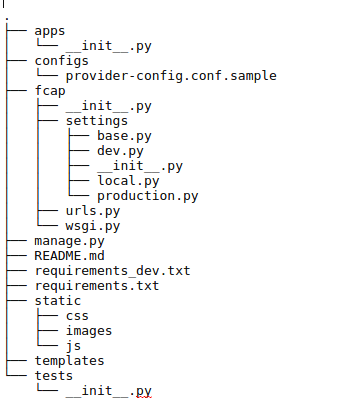

### Cấu trúc code của FCAP

* FCAP được phát triển dựa trên Django web frame work với các module cơ bản sau:

Cấu trúc trên một phần được tạo dựa trên cấu trúc [project template](https://github.com/Mischback/django-project-skeleton) của tác giả Mischback

* Trong đó:

- apps: thư mục chưa các "app" của project này, như: (cập nhật sau)

- config: thư mục chưa các file cấu hình cho project, như cấu hình cho các provider của các cloud...

- fcap: thư mục chứa các cấu hình URL chính và các cấu hình để Django hiểu về các thành phần code trong project này.

- tests: thư mục chưa các module test

* Ngoài ra:

- manage.py là CLI để quản lý project này như các project được phát triển từ Django khác.

- requirements.txt là tập các thư viện bên thứ 3 được yêu cầu như calplus...

- requirements_dev.txt là tập tin chứa các gói phụ thuộc cho quá trình phát triển

- templates : thư mục chứa các template của Django để gen ra các trang HTML trên giao diện

- static : thư mục chưa các file tính như ảnh, css, js...

- README.md : chứa các thông tin cơ bản về cài đặt, hướng dẫn chạy thử nghiệm...

* Cấu trúc của một app:

management
    ├── __init__.py
    ├── migrations
    │   ├── 0001_initial.py
    │   ├── 0002_auto_20161215_0002.py
    │   └── __init__.py
    ├── models.py
    ├── static
    │   └── assets
    │       ├── css
    │       ├── font-awesome
    │       ├── fonts
    │       ├── img
    │       └── js
    ├── templates
    │   └── management
    │       ├── about.html
    │       ├── app.html
    │       ├── base.html
    │       ├── network.html
    │       └── provider.html
    ├── urls.py
    └── views.py